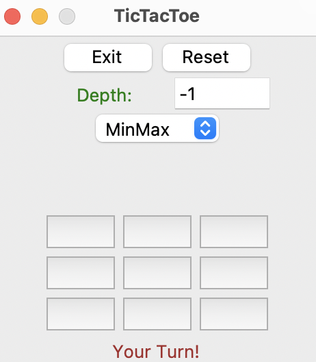
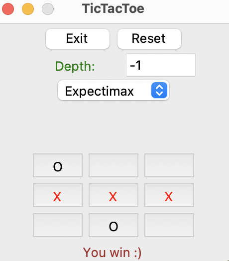
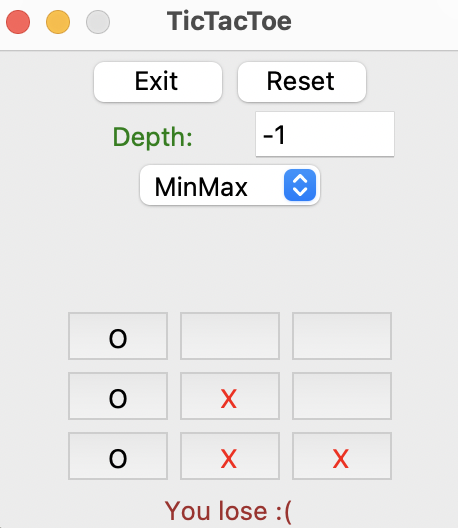
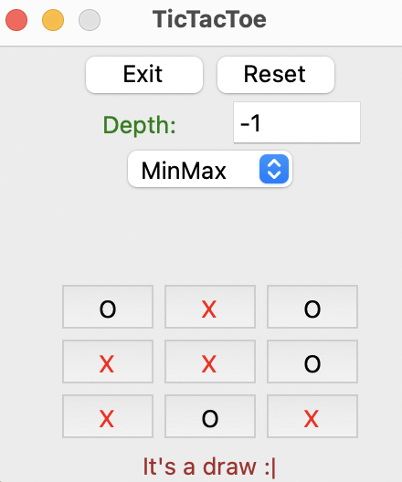

# Tic Tac Toe

Tic Tac Toe is a two-player game written in Python where a user can play against the computer in the classic game of Tic Tac Toe. 
There are three different algorithms -- MinMax, Alphabeta, and Expectimax --  for the player to choose from. The algorithm determines which moves the computer takes. The default algorithm is MinMax. 
The board dimensions are default 3 rows by 3 columns and 3 items in a line to be considered a match. The user can change the dimensions of the board when running the command to run the game. 
Note that the height, width, and number of items in a match must be equal to or greater than 3. If any of the dimensions are less than 3, the board will be sent to 3 x 3 x 3.

### Game on launch


To run the game using the default dimensions, type the following into the terminal:
```
python tic-tac-toe.py
```
To run the game using custom dimensions, type the following into the terminal and enter integers in the place of x, y, and z where x is the height, y is the width, and z is the number of items in a line to be considered a win:
```
python tic-tac-toe.py x y z
```

The first move belongs to the player and the game finishes when either the user or computer wins or if there is a draw. 

### User wins


### User loses


### Draw game

